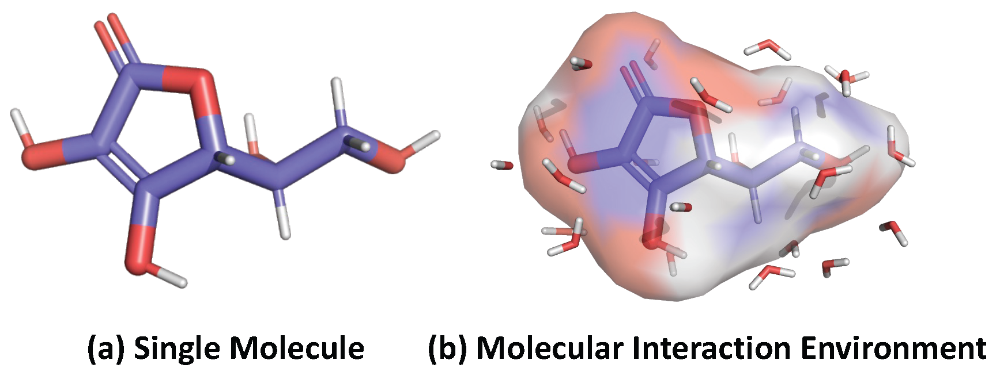

# 3DMRL

<p align="center">   
    <a href="https://pytorch.org/" alt="PyTorch">
      </a>
    <a href="https://neurips.cc/" alt="Conference">
        </a>
</p>

The official source code for [3D Interaction Geometric Pre-training for Molecular Relational Learning](https://arxiv.org/abs/2412.02957), accepted at NeurIPS 2025 (Spotlight).

## Overview
Molecular Relational Learning (MRL) is a rapidly growing field that focuses on understanding the interaction dynamics between molecules, which is crucial for applications ranging from catalyst engineering to drug discovery. Despite recent progress, earlier MRL approaches are limited to using only the 2D topological structure of molecules, as obtaining the 3D interaction geometry remains prohibitively expensive. This paper introduces a novel 3D geometric pre-training strategy for MRL (3DMRL) that incorporates a 3D virtual interaction environment, overcoming the limitations of costly traditional quantum mechanical calculation methods. With the constructed 3D virtual interaction environment, 3DMRL trains 2D MRL model to learn the global and local 3D geometric information of molecular interaction. Extensive experiments on various tasks using real-world datasets, including out-of-distribution and extrapolation scenarios, demonstrate the effectiveness of 3DMRL, showing up to a 24.93% improvement in performance across 40 tasks.

</img> 


### Requirements
- Python 3.7
- Pytorch 1.9.1
- RDKIT 2020.09.1
- Pytorch-Geometric 2.0.3

### How to run the code?
Please refer to the README.md file in each task folder for further instructions and details on how to run the code.

### Citation

```BibTex
@article{lee20243d,
  title={3D Interaction Geometric Pre-training for Molecular Relational Learning},
  author={Lee, Namkyeong and Oh, Yunhak and Noh, Heewoong and Na, Gyoung S and Xu, Minkai and Wang, Hanchen and Fu, Tianfan and Park, Chanyoung},
  journal={arXiv preprint arXiv:2412.02957},
  year={2024}
}
```